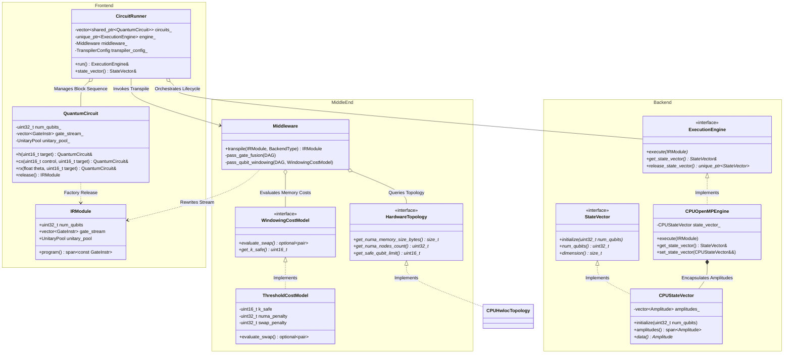
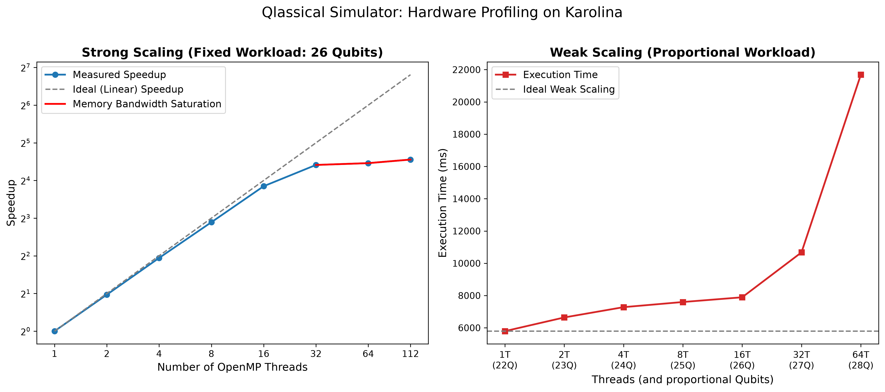

# Qlassical: A Hardware-Aware, Data-Oriented Quantum Circuit Simulator for High-Performance Computing

[](https://en.cppreference.com/w/cpp/20)
[](LICENSE)
[]()

## 1. Title and Abstract

**Qlassical** is an high-performance state-vector quantum circuit simulator developed in C++20. Designed specifically for High-Performance Computing (HPC) architectures (and evaluated on the **Karolina Supercomputer**), Qlassical addresses the primary performance bottleneck in classical quantum simulation: the **"Memory Wall"**. As quantum state dimensions scale exponentially as $2^N \times 16 \text{ bytes}$, simulation performance transitions rapidly from compute-bound to memory-bandwidth-bound.

Qlassical implements the full-stack compilation pipeline to go from a Quantum Circuit to the final StateVector:
$$\text{Frontend (IR Construction)} \longrightarrow \text{MiddleEnd (Hardware-Aware Transpilation)} \longrightarrow \text{Backend (Bitwise OpenMP Execution)}$$

By exploiting Data-Oriented Design (DOD), stack-allocated branchless matrix fusion, bitwise memory indexing, and non-uniform memory access (NUMA) domain windowing, Qlassical aims to maximize L1 cache prefetching, to reduce thread divergence, and to isolate cross-socket communication. 

To ensure complete experimental reproducibility across heterogeneous HPC clusters, a containerized environment definition (Apptainer / Singularity / Docker) is provided under `containers/qlassical.def`, bundling GCC 13, CMake 3.28, OpenMP 4.5, Eigen3 (v3.4), `hwloc` (v2.10), Catch2 (v3), and Google Benchmark (v1.8).

---

## 2. Architectural Overview & Software Engineering

Qlassical is built around layer isolation and zero-cost abstractions. High-level circuit generation is completely decoupled from topological optimization passes and hardware-specific execution kernels.

### 2.1 Complete Class Diagram



### 2.2 CircuitRunner and Zero-Copy Execution Orchestration

The `CircuitRunner` acts as the master orchestrator for complex or large-scale quantum circuits:

1. **Circuit Decomposition**: Long-depth circuits are partitioned into discrete logical sub-blocks (`std::shared_ptr<QuantumCircuit>`).
2. **Zero-Copy State Vector**: When transitioning between execution blocks, `CircuitRunner` extracts the physical `CPUStateVector` from the previous engine via move semantics (`set_state_vector(std::move(previous_sv))`). The multi-gigabyte complex amplitude array is never re-allocated or copied in RAM across block boundaries.
3. **Mid-Execution Backend Swapping & Hybrid Workflows**: Because `ExecutionEngine` presents an abstract virtual interface, `CircuitRunner` can dynamically transpile block $B_i$ for a CPU OpenMP engine and block $B_{i+1}$ for an MPI or GPU engine mid-execution, passing the state vector handle cleanly between execution engines.

---

## 3. Efficiency, Memory, and Data-Oriented Design

### 3.1 Plain Old Data (POD) & Move-Only Semantics
Standard Object-Oriented approaches model quantum gates as polymorphic objects (`virtual void apply(StateVector&)`), introducing virtual function call overhead, pointer indirection, and cache line fragmentation. Qlassical replaces polymorphic hierarchies with dense, cache-aligned Plain Old Data (POD) structures and C++20 `std::span` zero-copy memory views.

### 3.2 IRModule Hot/Cold Data Separation
The intermediate representation (`IRModule`) encodes instruction metadata into "hot" and "cold" memory paths:

```
          HOT PATH (L1 Stream)                  COLD PATH (Contiguous RAM)
   +---------------------------------+        +---------------------------------+
   | GateInstr [16B]                 |        | UnitaryPool                     |
   |   - GateType (1B)               |        |   - Flat std::vector<Amplitude> |
   |   - flags_arity (1B)            |  ----> |   - Stores 2^k x 2^k complex    |
   |   - qubits[4] (4B)              |        |     matrices for FUSED_BLOCK    |
   |   - payload (4B) [matrix_idx]   |        |     and custom UNITARY gates    |
   |   - uid (4B)                    |        +---------------------------------+
   +---------------------------------+
   | GateInstr [16B]                 |
   +---------------------------------+
```

- **Hot Data Stream**: A flat, contiguous array of `GateInstr` POD structures. Each `GateInstr` is engineered to align to 16 bytes using `alignas(16)`. Exactly four instructions fit into a standard 64-byte L1 cache line, maximizing CPU hardware prefetching during sequential kernel dispatch. The payload is implemented using `std::union` to further compress the instruction format.
- **Cold Data Storage**: Dense complex unitary matrices ($2^k \times 2^k$) generated during gate fusion or custom gate specification are offloaded into the `UnitaryPool`. `GateInstr` holds only a 32-bit offset index (`matrix_idx`) into this pool, avoiding pointer chasing.

---

## 4. The Backend: Bitwise Kernels

Quantum state vector evolution requires updating state amplitudes according to linear transformations. For an $N$-qubit system, state vector $|\psi\rangle$ is represented by $2^N$ complex double-precision amplitudes $\left(c_0, c_1, \dots, c_{2^N-1}\right)^T$.

### 4.1 Branchless Bitwise Hole Injection

Naive gate application loops over all $2^N$ indices and evaluates conditional `if` statements to check control and target bit states. This introduces thread divergence, branch mispredictions, and pipeline stalls.

Qlassical eliminates conditional branching by using an **algorithm-driven bitwise indexing trick**. To apply a single-qubit gate acting on target qubit $t$, the state vector updates pairs of amplitudes whose indices differ only at bit position $t$. Rather than iterating $2^N$ times with a branch, the kernel iterates exactly $2^{N-1}$ times over a contiguous integer range $k \in [0, 2^{N-1}-1)$.

For each thread iteration $k$, the physical state vector indices $(i_0, i_1)$ are constructed by inserting a zero bit ("hole") at position $t$:

$$\text{low} = k \ \& \ \left((1 \ll t) - 1\right)$$

$$\text{high} = \left(k \ \& \ \sim\!\left((1 \ll t) - 1\right)\right) \ll 1$$

$$i_0 = \text{low} \mid \text{high}$$

$$i_1 = i_0 \mid (1 \ll t)$$

```
      Bitstring Construction for Target Qubit t:
      k Index:  [ high_bits (N-1..t) ] [ low_bits (t-1..0) ]
                            |                        |
                            v                        v
      i_0:      [ high_bits (N-1..t) ] 0 [ low_bits (t-1..0) ]   <-- Amplitude c_0
      i_1:      [ high_bits (N-1..t) ] 1 [ low_bits (t-1..0) ]   <-- Amplitude c_1
```

For a 2-qubit controlled gate (e.g., CNOT with control $c$ and target $t$, assuming $q_0 = \min(c,t)$ and $q_1 = \max(c,t)$), two holes are injected simultaneously. The OpenMP kernel iterates exactly $2^{N-2}$ times:

$$\text{low} = k \ \& \ \left((1 \ll q_0) - 1\right)$$

$$\text{mid} = \left(k \ \& \ \left(\left((1 \ll (q_1 - 1)) - 1\right) \ \& \ \sim\!\left((1 \ll q_0) - 1\right)\right)\right) \ll 1$$

$$\text{high} = \left(k \ \& \ \sim\!\left((1 \ll (q_1 - 1)) - 1\right)\right) \ll 2$$

$$i_{\text{base}} = \text{low} \mid \text{mid} \mid \text{high}$$

$$i_{11} = i_{\text{base}} \mid (1 \ll c) \mid (1 \ll t)$$

A similar algorithm is implemented for native 3-qubits gates as well.

### 4.2 AVX-512 Vectorization and OpenMP Parallelization

Because every loop iteration $k$ computes independent, deterministic memory indices without shared write hazards, the computational workload is embarrassingly parallel. 

```cpp
const int64_t limit = static_cast<int64_t>(std::size_t{1} << (num_qubits - 1));
const std::size_t mask = (std::size_t{1} << target) - 1;

// Assuming u00, u01... are the elements of the 2x2 unitary matrix

#pragma omp parallel for schedule(static)
for (int64_t k = 0; k < limit; ++k) {
    const std::size_t low  = static_cast<std::size_t>(k) & mask;
    const std::size_t high = (static_cast<std::size_t>(k) & ~mask) << 1;
    const std::size_t i0   = low | high;
    const std::size_t i1   = i0 | (std::size_t{1} << target);

    const Amplitude v0 = amp[i0];
    const Amplitude v1 = amp[i1];

    amp[i0] = u00 * v0 + u01 * v1;
    amp[i1] = u10 * v0 + u11 * v1;
}
```

By enforcing `#pragma omp parallel for schedule(static)`, OpenMP assigns contiguous blocks of $k$ to each thread.

---

## 5. Middleware: Gate Fusion & Hardware-Awareness

### 5.1 $O(N)$ Causality DAG Construction
Before execution, the `Middleware` builds a Directed Acyclic Graph (DAG) of the quantum circuit to track data dependency causality. Frontier tracking maintains an array `frontier[qubit_id]` storing the last node modifying each qubit. Node generation operates in $O(N)$ linear time without dynamic allocations by pre-allocating graph capacity.

### 5.2 Stack-Allocated Branchless Gate Fusion
When multiple single- and multi-qubit gates act sequentially on overlapping target qubits, executing them independently requires repeated global memory sweeps. Gate fusion merges adjacent gates into a single $2^k \times 2^k$ dense unitary matrix.

```
       Separate Gate Executions:                Fused Unitary Execution:
  +----+   +----+   +----+   +----+          +--------------------------+
  | H  |-->| RZ |-->| X  |-->| H  |   ===>   |   U_fused = H*X*RZ*H     |
  +----+   +----+   +----+   +----+          |   (Single Memory Pass)   |
  +-------------------------------+          +--------------------------+
```

To eliminate operating system heap allocation overhead inside compilation passes, matrix expansion is performed entirely on the stack using static buffers (`alignas(64) std::array<Amplitude, 16>`):

1. **Sub-block Expansion (`FusionMath::expand_matrix`)**: Given a gate $U_1$ acting on a subset of qubits $Q_{\text{sub}} \subset Q_{\text{full}}$, it is expanded to the full $2^k \times 2^k$ space via Kronecker products with identity matrices.
2. **Dense Eigen Matrix Product**: The fused operator is computed as $U_{\text{fused}} = U_2 \times U_1$ using stack-mapped `Eigen::Matrix` objects.
3. **Pool Allocation**: The resulting matrix is pushed once into the `UnitaryPool`, and the DAG replaces the original instructions with a single `FUSED_BLOCK` instruction.

---

## 6. Breaking the Memory Wall: NUMA Domains

### 6.1 NUMA First-Touch Allocation Policy
On NUMA systems, the Linux virtual memory subsystem implements a **First-Touch Allocation Policy**. Virtual memory allocation routines (e.g. `malloc` or `std::vector::resize`) only reserve contiguous address space; physical pages are not committed into RAM until a thread performs the first write operation. The physical page is pinned to the local memory controller of the CPU socket hosting the thread that executes that initial write.

If the multi-gigabyte state vector is initialized sequentially by the master thread (e.g., standard `std::fill` or thread-0 loops):
- All physical pages across the entire state space are pinned exclusively to NUMA Domain 0.
- When worker threads on remote NUMA domains or opposite CPU sockets execute subsequent gate kernels, 100% of their amplitude reads and writes are forced across the inter-socket interconnect.
- This saturates the inter-socket link, induces memory-bus contention, and degrades parallel scaling.

Qlassical structurally eliminates this bottleneck directly inside `CPUStateVector::initialize` by parallelizing the first touch:

```cpp
void CPUStateVector::initialize(uint32_t num_qubits) {
    num_qubits_ = num_qubits;
    const std::size_t dim = static_cast<std::size_t>(1) << num_qubits;

    // Allocate virtual memory space
    amplitudes_.resize(dim);

    const auto dim_signed = static_cast<int64_t>(dim);

    // NUMA First-Touch Initialization:
    // Parallelizing zeroing with schedule(static) ensures physical memory pages
    // are mapped exactly to the local memory controller of the thread that will
    // subsequently process them, structurally guaranteeing locality from cycle 0.
    #pragma omp parallel for schedule(static)
    for (int64_t i = 0; i < dim_signed; ++i) {
        amplitudes_[static_cast<std::size_t>(i)] = Amplitude{0.0, 0.0};
    }

    // Set ground state |0...0> amplitude
    amplitudes_[0] = Amplitude{1.0, 0.0};
}
```

By enforcing `#pragma omp parallel for schedule(static)`, OpenMP deterministically divides the state vector into $P$ uniform, contiguous index ranges across $P$ threads. Because all downstream execution kernels in `CPUOpenMPEngine` employ the identical `schedule(static)` partitioning scheme, each thread accesses amplitudes situated on memory pages physically located on its local memory controller. This guarantees optimal memory locality and eliminates cross-domain memory placement hazards.

### 6.2 Exponential RAM Scaling and the Interconnect Bottleneck
Simulating an $N$-qubit quantum register requires tracking $2^N$ complex double-precision amplitudes (`sizeof(std::complex<double>) = 16` bytes). The memory footprint scales exponentially according to:

$$\text{Physical RAM Footprint} = 2^N \times 16 \text{ bytes}$$

The table below summarizes the physical memory requirements across key HPC architectural memory tiers:

| Qubits ($N$) | Complex Amplitudes | Physical RAM Required | HPC Memory Hierarchy Tier | Hardware Characteristics & Bandwidth |
|:---:|:---:|:---:|:---:|:---|
| **20** | $1,048,576$ | **16 MB** | **L3 Cache** | Fits entirely inside CPU on-die L3 cache; peak memory bandwidth. |
| **24** | $16,777,216$ | **256 MB** | **Local RAM** | Resides within the local NUMA socket's DDR4/DDR5 channels. |
| **26** | $67,108,864$ | **1 GB** | **Local RAM Limit** | Reaches the boundary of a single NUMA domain's cacheable working set. |
| **28** | $268,435,456$ | **4 GB** | **Cross-NUMA Interconnect Active** | State vector spans multiple NUMA domains. |
| **30** | $1,073,741,824$ | **16 GB** | **Dual-Socket Saturation** | Saturares multiple NUMA nodes; heavy cross-socket bus contention. |
| **32** | $4,294,967,296$ | **64 GB** | **Inter-Socket Bandwidth Bound** | Full node memory sweep per gate. |

As problem scale increases, memory access patterns transition across distinct architectural tiers: from ultra-low-latency on-die L3 cache, through local DDR4 memory channels, until spilling past 26 qubits into remote NUMA nodes leading to a performance collapse known as the **Memory Wall**.

### 6.3 The $k_{\text{safe}}$ Topology Threshold and `ThresholdCostModel`
To prevent arbitrary cross-socket traffic during circuit execution, Qlassical implements hardware-topology-aware qubit windowing. Through `hwloc` topology inspection (`CPUHwlocTopology`), the simulator computes $k_{\text{safe}}$: the maximum number of logical qubits whose state vector partition fits entirely within the local RAM of a single NUMA socket:

$$k_{\text{safe}} = \left\lfloor \log_2 \left( \frac{\text{Local NUMA Node Usable RAM Bytes}}{\text{sizeof(Amplitude)}} \right) \right\rfloor$$

When a quantum circuit executes gates on qubits mapped at or above bit index $k_{\text{safe}}$, every stride in the state vector spans across the $2^{k_{\text{safe}}}$ index boundary. This causes memory accesses to alternate between local and remote NUMA nodes, incurring continuous cross-socket communication overhead.

To prevent this, the `Middleware` transpiler uses the `ThresholdCostModel` to evaluate a sliding window of circuit depth:

```cpp
std::optional<std::pair<uint16_t, uint16_t>> ThresholdCostModel::evaluate_swap(
    std::span<const uint32_t> window_frequencies,
    std::span<const uint16_t> log_to_phys,
    std::span<const uint16_t> phys_to_log) const 
{
    uint16_t q_cand = 0xFFFF;
    uint32_t max_retention = 0;

    // Identify an active logical qubit physically mapped outside the safe NUMA zone (phys > k_safe)
    for (std::size_t log_q = 0; log_q < window_frequencies.size(); ++log_q) {
        if (window_frequencies[log_q] > 0 && log_to_phys[log_q] > k_safe) {
            uint32_t retention = window_frequencies[log_q] * numa_penalty;
            if (retention >= swap_penalty && retention > max_retention) {
                max_retention = retention;
                q_cand = static_cast<uint16_t>(log_q);
            }
        }
    }

    if (q_cand == 0xFFFF) return std::nullopt;

    // Select an inactive victim qubit inside the safe zone (phys <= k_safe)
    for (std::size_t log_v = 0; log_v < window_frequencies.size(); ++log_v) {
        if (log_to_phys[log_v] <= k_safe && window_frequencies[log_v] == 0) {
            return std::make_pair(q_cand, static_cast<uint16_t>(log_v));
        }
    }

    return std::nullopt;
}
```

The $k_{\text{safe}}$ logic operates via three coordinated stages:
1. **Interconnect Penalty Tracking:** The transpiler monitors qubit access frequencies within a lookahead window. If an active qubit is mapped outside the local NUMA boundary ($q_{\text{phys}} > k_{\text{safe}}$), its operations are penalized by `numa_penalty`.
2. **Threshold Decision:** When the accumulated penalty exceeds the overhead of a state vector permutation (`swap_penalty`), the cost model triggers a permutation.
3. **`GLOBAL_SWAP` Permutation:** The transpiler injects a `GLOBAL_SWAP` instruction to physically permute the state vector in a single, NUMA-aware streaming pass. This pulls the active qubit into the safe zone ($q_{\text{phys}} \le k_{\text{safe}}$) and evicts an inactive "victim" qubit to the outer domain.
4. **Locality Guarantee:** Subsequent gate operations on the promoted qubit execute with 100% local NUMA memory controller bandwidth.

---

## 7. Benchmarking and Scaling Results

### 7.1 Benchmarking Methodology & Environment
Empirical evaluation was conducted on the **Karolina Supercomputer** (IT4Innovations National Supercomputing Center):
- **Compute Node Architecture**: Dual AMD EPYC 7H12 processors (128 physical cores per node, 2.6 GHz base frequency, 256 hardware threads, 8 NUMA domains across 2 sockets).
- **Memory Subsystem**: 256 GB DDR4-3200 ECC RAM (32 GB per NUMA domain, providing ~350 GB/s peak aggregate memory bandwidth).
- **Toolchain & Software Stack**: GCC 13.2.0 (`-O3 -march=native -ffast-math`), OpenMP 4.5, Eigen3 3.4.0, hwloc 2.10.0, Catch2 3.4.0, Google Benchmark 1.8.3, CMake 3.28.3 (matching `containers/qlassical.def` on Ubuntu 24.04 LTS).

### 7.2 Empirical Benchmark Telemetry: 765-Gate Circuit Matrix
To benchmark the interplay between hardware-aware transpilation and gate fusion, a clustered quantum circuit consisting of **765 gates** (depth 15 per cluster, cluster size 6) was evaluated from $N = 24$ to $N = 28$ qubits across four distinct configurations:
1. **Baseline (Config 0)**: Un-optimized execution stream (raw gate dispatch, no HW awareness, no gate fusion).
2. **SWAP-Only (Config 1)**: Hardware-aware NUMA windowing enabled (`enable_hw_awareness = true`, `k_safe = 18`), gate fusion disabled.
3. **Fusion-Only (Config 2)**: Gate fusion enabled (`enable_gate_fusion = true`), hardware-aware windowing disabled.
4. **Swap+Fusion (Config 3)**: Combined hardware-aware SWAP windowing and stack-allocated gate fusion enabled.

The table below reports the real wall-clock execution times extracted directly from `benchmarks/bench.txt` on node `cn719`:

| Qubits ($N$) | State Vector RAM | Baseline (Config 0) | SWAP-Only (Config 1) | Fusion-Only (Config 2) | Swap+Fusion (Config 3) |
|:---:|:---:|:---:|:---:|:---:|:---:|
| **24** | 256 MB | 1,497 ms | 210 ms | 454 ms | **239 ms** |
| **25** | 512 MB | 2,435 ms | 280 ms | 878 ms | **493 ms** |
| **26** | 1.0 GB | 37,282 ms | 39,211 ms | 5,019 ms | **4,853 ms** |
| **27** | 2.0 GB | 81,743 ms | 86,427 ms | 10,713 ms | **10,349 ms** |
| **28** | 4.0 GB | 169,314 ms (2.82 min) | 176,816 ms (2.95 min) | 22,069 ms (22.1 s) | **21,018 ms (21.0 s)** |

**Instruction Stream Telemetry (at 28 Qubits):**
- **Baseline (Config 0)**: `765 -> 765` gates (0% reduction)
- **SWAP-Only (Config 1)**: `765 -> 774` gates (+9 `GLOBAL_SWAP` instructions injected)
- **Fusion-Only (Config 2)**: `765 -> 76` operations (~90.1% compression via dense unitary fusion)
- **Swap+Fusion (Config 3)**: `765 -> 85` operations (76 fused unitary blocks + 9 NUMA-aware SWAPs)

### 7.3 In-Depth Performance Analysis

#### 1. The Memory Wall: Empirical Interconnect Transition (25 $\to$ 26 Qubits)
A prominent inflection point in the empirical data occurs when transitioning from 25 to 26 qubits:
- At 24 qubits (256 MB), the Baseline executes in **1,497 ms**. At 25 qubits (512 MB), the Baseline executes in **2,435 ms**—a modest $1.63\times$ increase, scaling sub-linearly relative to the doubling of state vector size due to cache reuse.
- However, moving from 25 to 26 qubits (1.0 GB), Baseline execution time explodes from **2,435 ms to 37,282 ms**—a staggering **$15.31\times$ runtime penalty** for a single qubit increase ($2\times$ memory footprint).

This discontinuity provides empirical proof of the **Memory Wall**. At $N \le 25$, memory allocations fit cleanly inside local socket RAM and on-die cache hierarchies. At $N = 26$, the working set exceeds single-socket boundaries. Un-optimized gate kernels repeatedly access memory across the inter-socket interconnect (AMD Infinity Fabric). Remote memory access latencies, cache coherence traffic, and interconnect serialization immediately dominate execution time over raw arithmetic throughput.

#### 2. Fusion Compression: Eliminating Global Memory Sweeps
Gate Fusion (Config 2) compresses the original 765 instructions into just **76 fused dense matrix blocks**, representing a **$10.07\times$ instruction reduction**.
- In standard simulation, each single-qubit or two-qubit gate requires a full OpenMP parallel sweep over the multi-gigabyte state vector. Executing 765 gates requires 765 full memory sweeps, incurring immense memory-bus traffic and instruction dispatch overhead.
- Gate Fusion merges adjacent gates on overlapping qubits into $2^k \times 2^k$ unitaries using stack-allocated Kronecker products (`FusionMath`). Applying a fused block requires only a single pass over memory, performing higher-density arithmetic per cache line loaded.
- As a result, at 28 qubits, Fusion-Only slashes execution time from **169,314 ms down to 22,069 ms**—delivering a **$7.67\times$ speedup** by shifting the bottleneck away from memory-bus traversal and instruction dispatch.

#### 3. Hardware-Aware Synergy: The Counter-Intuitive Brilliance of Swap+Fusion
The most remarkable result of the benchmark matrix lies in the comparison between Fusion-Only (Config 2) and Swap+Fusion (Config 3) at 28 qubits:
- Config 2 executes **76 operations** in **22,069 ms**.
- Config 3 executes **85 operations** in **21,018 ms** (a net speedup of **1,051 ms**).

Under conventional algorithmic models, injecting 9 additional high-dimensional `GLOBAL_SWAP` permutations should degrade runtime. However, Swap+Fusion is the **fastest overall configuration**. 

**Why?** In Config 2, the 76 fused operations still touch qubits that straddle NUMA domains, forcing dense matrix operations to repeatedly stall on remote socket memory access. In Config 3, the transpiler invests in 9 streaming `GLOBAL_SWAP` passes to permute the state vector, migrating active qubits into the local NUMA domain ($k_{\text{safe}}$). The subsequent 76 dense matrix applications execute with 100% local memory controller bandwidth. The latency savings across the 76 fused operations completely overshadow the computational cost of the 9 extra SWAPs, demonstrating the paramount importance of hardware-topology-aware optimization in HPC quantum simulation.

### 7.4 Strong and Weak Scaling Profiles



The figure above illustrates both the linear strong scaling profile (up to the memory bus saturation limit) and the exponential weak scaling spike:

- **Strong Scaling (Left Plot: Fixed 26-Qubit Workload across 1 to 112 Threads):**
  - **Linear Region (1 $\to$ 16 Threads):** Near-ideal linear speedup, progressing from $112,635 \text{ ms}$ (1 thread) to $7,823 \text{ ms}$ (16 threads)—achieving a **$14.40\times$ speedup** ($90.0\%$ parallel efficiency). In this regime, execution is compute-efficient and memory channels are not fully saturated.
  - **Saturation Plateau (32 $\to$ 112 Threads):** Beyond 16 threads, speedup plateaus ($5,289 \text{ ms}$ at 32 threads, $5,117 \text{ ms}$ at 64 threads, and $4,791 \text{ ms}$ at 112 threads, peaking at $\sim 23.5\times$). Adding additional CPU cores gives diminishing returns because the memory controllers reach the physical saturation limit of the DDR4-3200 memory bus (>350 GB/s), empirically confirming that state vector simulation is memory-bandwidth bound.

- **Weak Scaling (Right Plot: Constant Memory Per Thread from 22 to 28 Qubits):**
  - Thread count is scaled proportionally with memory footprint: 1 thread at 22Q ($5,792 \text{ ms}$), 2 threads at 23Q ($6,640 \text{ ms}$), 4 threads at 24Q ($7,279 \text{ ms}$), 8 threads at 25Q ($7,598 \text{ ms}$), up to 16 threads at 26Q ($7,891 \text{ ms}$). Across this range, runtime remains remarkably flat and predictable.
  - **Interconnect Scaling Jump (27 $\to$ 28 Qubits):** As the workload expands to 32 threads at 27Q ($10,674 \text{ ms}$) and 64 threads at 28Q ($21,685 \text{ ms}$), execution time experiences an exponential weak scaling spike. This jump visually confirms the exact transition where the state vector spills across physical NUMA sockets, incurring cross-socket Infinity Fabric latency.

---

## 8. Future Extensions

The decoupled software architecture of Qlassical provides a direct foundation for distributed and heterogeneous HPC scaling:

1. **MPI Multi-Node Engine (`MPIExecutionEngine`)**: The disembodied `StateVector` interface permits swapping `CPUStateVector` for an `MPIStateVector`. Amplitudes beyond $N_{\text{local}}$ are distributed across cluster nodes via RDMA (InfiniBand/RoCE), using `GLOBAL_SWAP` logic to schedule non-blocking `MPI_Isend` / `MPI_Irecv` exchange phases.
2. **GPU Acceleration (`CUDAExecutionEngine` / `HIPExecutionEngine`)**: Because `GateInstr` streams are plain 16-byte structs and `UnitaryPool` matrices are contiguous arrays, the instruction stream can be uploaded directly to GPU constant memory (`__constant__`), dispatching CUDA/HIP bitwise kernels without modifying Frontend circuit builders or MiddleEnd transpiler passes.

---

## 9. Build and Installation

### 9.1 Containerized Execution (Recommended)
To run Qlassical inside an isolated Apptainer / Singularity environment:

```bash
# Build the Apptainer image from definition file
apptainer build qlassical.sif containers/qlassical.def

# Run tests inside the container
apptainer exec qlassical.sif ./build/test_backend
```

### 9.2 Native Compilation

**Prerequisites**: C++20 compiler (GCC 13+ or Clang 15+), CMake 3.22+ (CMake 3.28+ in container), OpenMP 4.5+, Eigen3 3.4+, hwloc 2.10+, Catch2 v3 (3.4+), Google Benchmark 1.8+.

```bash
# Clone repository
git clone https://github.com/DanieleConfalonieri/Qlassical-Quantum-HPC-Simulator.git
cd Qlassical-Quantum-HPC-Simulator

# Configure build
cmake -B build -S . -DCMAKE_BUILD_TYPE=Release

# Compile project binaries
cmake --build build -j$(nproc)

# Run complete Catch2 test suite
ctest --test-dir build --output-on-failure
```

---

## 10. License

This project is licensed under the MIT License - see the [LICENSE](LICENSE) file for details.
