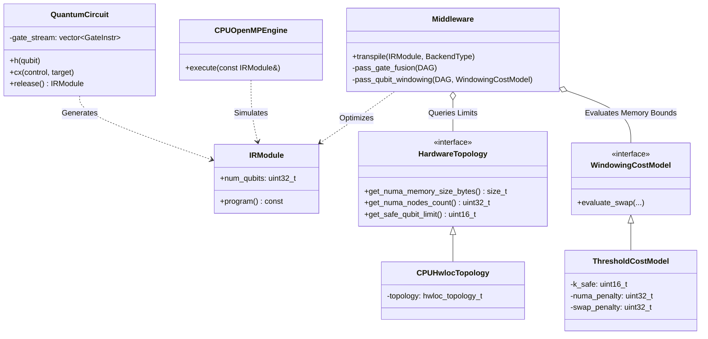

# Qlassical: High-Performance Quantum Circuit Simulator

A highly optimized, hardware-aware C++ implementation of a state-vector quantum circuit simulator designed for **High Performance Computing (HPC)** environments.

## Overview

**Qlassical** is an extensible and robust framework for simulating quantum circuits. Built entirely around data-oriented design (DOD) principles, it provides a transparent and efficient pipeline from quantum circuit definition to hardware-accelerated state-vector simulation. The core architecture uses modern C++20 features, extensive shared-memory parallelization via OpenMP, and rigorous cache and NUMA topology awareness to eliminate classical simulation bottlenecks like TLB misses and inter-socket traffic.

## Key Features

* **Hardware-Aware Transpilation (Middleware):**
    * **NUMA-Aware Qubit Windowing:** Employs a `ThresholdCostModel` and a "Chunked Breathing Window" algorithm to dynamically restrict the working set of qubits, injecting `GLOBAL_SWAP` operations to strictly eliminate inter-NUMA socket traffic.
    * **O(N) Gate Fusion:** Automatically merges adjacent instructions into dense $2^k \times 2^k$ unitaries via a highly efficient index-based BFS queue to maximize arithmetic intensity.
    * **Topology Introspection:** Integrates with the `hwloc` library to parse physical machine topologies.
* **HPC Optimizations:**
    * **Zero-Allocation Hot Paths:** Aggressively relies on static memory, `std::span`, and stack-allocated generic math objects (`Eigen3` arrays) during hot simulation loops.
    * **OpenMP Parallelization:** Fully multithreaded simulation backend.
* **Modern Interface (Frontend):**
    * Intuitive `QuantumCircuit` API for rapidly defining quantum logic streams.
* **Verification & Benchmarking:**
    * Deeply tested using **Catch2**.

## Project Structure

``` text
qlassical/
├── include/
│   ├── frontend/        # QuantumCircuit API & IRModule structure
│   ├── middleware/      # JIT Streamer, DAG Fusion, and HW Topology
│   └── backend/         # OpenMP State-Vector Engine & Aligned Allocator
├── benchmarks/          # Google Benchmark harnesses (bench_middleware)
├── tests/
│   ├── frontend/        # Unit tests for the IR generation
│   ├── middleware/      # TLB Hazard mapping and fusion math tests
│   ├── backend/         # State vector kernel tests
│   └── integration/     # End-to-end algorithmic tests
├── CMakeLists.txt       # CMake build configuration
└── README.md
```

## Software Architecture

Qlassical is built around a three-stage pipelined architecture (Frontend -> Middleware -> Backend) to provide strict isolation between logical circuit definitions, topological graph rewrites, and the physical mathematical execution.

### High-Level Class Diagram



## Implementation Details & Design Choices

### The Middleware: JIT Transpilation & Qubit Windowing
The most critical bottleneck in large-scale classical simulation of quantum systems is memory bandwidth, specifically inter-socket NUMA boundaries. Qlassical implements a bespoke **Chunked Breathing Window** algorithm to combat this. 

1. **Topology Awareness**: Using `hwloc`, the simulator computes a hardware-specific $k_{safe}$ limit, representing the maximum number of qubits whose state vector fits entirely within the local memory of a single NUMA node.
2. **Chunking**: The middleware parses the Directed Acyclic Graph (DAG) into contiguous chunks of instructions, dynamically ensuring that no single chunk exceeds $k_{safe}$ unique active qubits.
3. **ThresholdCostModel**: Rather than a greedy eviction policy, Qlassical uses a tunable penalty model to weigh the cost of injecting `GLOBAL_SWAP` instructions against the penalty of fetching state data across NUMA domains.
4. **Boundary Injection**: SWAPs are executed entirely at the boundaries between chunks. This perfectly batches memory transfers into distinct pre-fetch phases, isolating simulation kernels into tightly cache-localized operations.

### Data-Oriented Design (DOD)
Instead of deep OOP hierarchies mapping `class Gate` to `class CXGate`, Qlassical implements circuits as an `IRModule` (Intermediate Representation) wrapping flat, strictly-typed `GateInstr` arrays. This guarantees contiguous memory access patterns for the execution kernels and eradicates dynamic heap allocations within the engine's hot-loops.

### O(N) Gate Fusion
Standard implementations of DAG-based transpiler passes often exhibit $O(N^2)$ algorithmic overhead when computing connected components for gate fusion. Qlassical utilizes a high-performance index-based BFS queue, processing complex topological merges in strict linear time to keep Just-In-Time (JIT) compilation overhead negligible.

## Build and Installation

### Dependencies
The project leverages a robust containerized setup to ensure maximum portability on HPC clusters. The core dependencies include:
* **C++20 Compiler** (e.g., GCC 13+)
* **CMake** 3.22+
* **hwloc** (`libhwloc-dev`)
* **OpenMP**
* **Catch2** (v3)
* **Eigen3** (v3.4)
* **Google Benchmark**

### Building

```bash
mkdir build && cd build
cmake -DCMAKE_BUILD_TYPE=Release ..
make -j
```

### Running Tests and Benchmarks
Test suites are automatically discovered via Catch2 integration:
```bash
./test_frontend
./test_middleware
./test_integration
```

To validate middleware optimization overheads:
```bash
./bench_middleware
```
