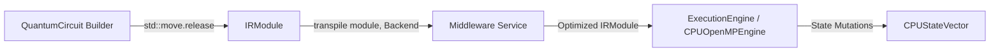

# Operations Diary: Middle-End & CircuitRunner Architecture

**Project:** Qlassical — Quantum Circuit Simulator for HPC Environments  
**Date:** August 17, 2026  
**Scope:** Design, implementation, and architectural refinement of the Middleware (Middle-End) and CircuitRunner layers.

---

## 1. Executive Summary

This session focused on designing and implementing the execution orchestration and middle-end transpilation pipeline for Qlassical:
1. **`include/middleware/middleware.hpp`**: The hardware-aware transpilation and optimization layer between Frontend and Backend.
2. **`include/frontend/circuit_runner.hpp`**: The top-level execution runner orchestrating multi-block circuit pipelines with zero-copy state vector continuity.
3. **`include/backend/cpu_openmp_engine.hpp`**: Supporting move semantics and state vector extraction for zero-copy block chaining.
4. **`tests/frontend/test_circuit_runner.cpp`**: Comprehensive unit and integration test suite (Catch2).
5. **Architectural Refinement & Decoupling**: Eliminating tight coupling between `Middleware` and `BackendType`, operating directly on `IRModule` rather than `QuantumCircuit`.

---

## 2. Chronological Log of Operations

```
+-----------------------------------------------------------------------------------+
| Chronology of Operations                                                          |
+-----------------------------------------------------------------------------------+
|  Step 1: Design of Middleware & CircuitRunner (Initial Architecture)              |
|  Step 2: Implementation of State Vector Move & Extraction in CPUOpenMPEngine       |
|  Step 3: Creation of the Complete CircuitRunner Test Suite                        |
|  Step 4: Identification of Architecture Flaws (Coupling & Layer Inversion)         |
|  Step 5: Refactoring of Middleware (Stateless Transpiler on IRModule)             |
|  Step 6: Refactoring of CircuitRunner Pipeline (Extract IR -> Transpile -> Exec) |
|  Step 7: Updating Tests with Middleware Transpilation Coverage                   |
+-----------------------------------------------------------------------------------+
```

---

## 3. Initial Architecture (Phase 1)

### 3.1 Motivation & Layering
In the initial design, the system was decomposed into three functional layers:
- **FrontEnd**: Circuit construction using fluent builder API (`QuantumCircuit`) producing an `IRModule`.
- **MiddleEnd (`Middleware`)**: Target-aware transpilation, gate fusion into `UnitaryPool`, and NUMA stride analysis.
- **BackEnd (`ExecutionEngine`)**: Physical execution and state vector mutation via OpenMP / MPI / GPU.

### 3.2 Initial `Middleware` Design
The initial `Middleware` class was tied to a specific `Backend` upon instantiation:
```cpp
// (Initial Version)
class Middleware {
public:
    constexpr Middleware() noexcept : backend_(Backend::CPU_OPENMP) {}
    explicit constexpr Middleware(Backend backend) noexcept : backend_(backend) {}

    void transpile(std::shared_ptr<QuantumCircuit> circuit) {
        if (!circuit) throw std::invalid_argument(...);
        switch (backend_) {
            case Backend::CPU_OPENMP: transpile_cpu_openmp(circuit); break;
            case Backend::MPI:        transpile_mpi(circuit); break;
            case Backend::GPU:        transpile_gpu(circuit); break;
        }
    }
private:
    Backend backend_ = Backend::CPU_OPENMP;
    void transpile_cpu_openmp(const std::shared_ptr<QuantumCircuit>& circuit);
    // ...
};
```

### 3.3 Initial `CircuitRunner` Design
`CircuitRunner` was implemented to manage either a single `QuantumCircuit` block or a sequential `std::vector<std::shared_ptr<QuantumCircuit>>`:
- Initialized `middleware_(backend)` in constructor.
- In `run()`:
  1. Invoked `middleware_.transpile(circuit)` on `QuantumCircuit`.
  2. Released `IRModule module = std::move(*circuit).release()`.
  3. Created `CPUOpenMPEngine` and dispatched `engine->execute(module)`.
  4. Extracted state vector via `std::move(*engine).extract_state_vector()` to pass to the next block without memory allocations.

### 3.4 Supporting Backend Changes
To allow zero-copy state vector handoff between circuit blocks, `CPUOpenMPEngine` in `include/backend/cpu_openmp_engine.hpp` was enhanced with:
- Move constructor: `explicit CPUOpenMPEngine(CPUStateVector&& sv) noexcept`.
- State vector extractor: `[[nodiscard]] CPUStateVector extract_state_vector() && noexcept`.

---

## 4. Problem Identification & Architectural Critique

During design review, two major encapsulation and abstraction flaws were identified:

### Flaw 1: Tight Coupling between `Middleware` and `BackendType`
- **Issue**: `Middleware` stored `backend_` in its private state and required the backend at construction time (`Middleware(backend)`).
- **Consequence**: To transpile circuits for different backends, callers had to either instantiate multiple `Middleware` objects or mutate shared state via setters (`set_backend`), breaking immutability and thread safety.
- **Principle Violated**: Open-Closed Principle / Stateless Transformation Service. A compiler/transpiler pass manager should be a service that applies transformations parameterized by the target hardware.

### Flaw 2: Layer Inversion (`QuantumCircuit` vs `IRModule`)
- **Issue**: `transpile()` accepted `std::shared_ptr<QuantumCircuit>`.
- **Consequence**: `QuantumCircuit` is simply the high-level frontend builder/AST wrapper, whereas hardware-aware optimizations (gate fusion, decomposition, swaps) operate on the intermediate representation (`IRModule`).
- **Correct Flow**: The user releases the `IRModule` from the frontend builder, passes the `IRModule` to the `Middleware` for optimization, and then hands the optimized `IRModule` to the backend `ExecutionEngine`.

---

## 5. Refined Architecture (Phase 2)



### 5.1 Refactored `Middleware` (`include/middleware/middleware.hpp`)
1. **Default Constructor Only**: Removed backend-specific constructor. `Middleware` is now stateless with respect to target architecture.
2. **Target Backend Parameter in `transpile()`**: Backend is now passed per-transpile call (`transpile(IRModule&, Backend = Backend::CPU_OPENMP)`).
3. **Operates directly on `IRModule&`**: Passes modify the instruction stream (`gate_stream`) and unitary pool (`unitary_pool`) in-place.

```cpp
namespace qlassical::middleware {

    enum class Backend : uint8_t {
        CPU_OPENMP = 0x00,
        MPI        = 0x01,
        GPU        = 0x02
    };

    using BackendType = Backend;

    class Middleware {
    public:
        constexpr Middleware() noexcept = default;
        Middleware(Middleware&&) noexcept = default;
        Middleware& operator=(Middleware&&) noexcept = default;
        Middleware(const Middleware&) = default;
        Middleware& operator=(const Middleware&) = default;
        ~Middleware() = default;

        void transpile(IRModule& module, Backend backend = Backend::CPU_OPENMP) {
            switch (backend) {
                case Backend::CPU_OPENMP: transpile_cpu_openmp(module); break;
                case Backend::MPI:        transpile_mpi(module); break;
                case Backend::GPU:        transpile_gpu(module); break;
                default:                  transpile_cpu_openmp(module); break;
            }
        }

    private:
        void transpile_cpu_openmp([[maybe_unused]] IRModule& module) { /* TODO */ }
        void transpile_mpi([[maybe_unused]] IRModule& module)        { /* TODO */ }
        void transpile_gpu([[maybe_unused]] IRModule& module)        { /* TODO */ }
    };
}
```

### 5.2 Refactored `CircuitRunner` (`include/frontend/circuit_runner.hpp`)
1. **Constructor**: `middleware_` is default-constructed without backend coupling.
2. **`run()` Pipeline**:
   - Step 1: Release `IRModule module = std::move(*circuit).release();`
   - Step 2: Call `middleware_.transpile(module, backend_type_);`
   - Step 3: Dispatch `engine->execute(module.program(), module.unitaries());`

```cpp
// Within CircuitRunner::run() loop:
for (std::size_t b = 0; b < circuits_.size(); ++b) {
    auto& circuit = circuits_[b];
    // 1. Zero-Copy IR Extraction: Release IRModule from builder
    IRModule module = std::move(*circuit).release();

    // 2. MiddleEnd Transpilation: Target-aware optimization passes
    middleware_.transpile(module, backend_type_);

    const uint32_t nq = module.num_qubits;
    
    // 3. BackEnd Engine Setup & Execution
    // ...
}
```

---

## 6. Test Suite & Validation Strategy (`tests/frontend/test_circuit_runner.cpp`)

The test suite was updated and organized into 10 distinct sections:

| Section | Target | Scenarios Covered |
|---|---|---|
| **1. Constructors** | `CircuitRunner` | Single-block, multi-block, default and explicit `Backend`, nullptr detection, empty block list. |
| **2. Move Semantics** | `CircuitRunner` | Move constructor, move assignment, deleted copy operations. |
| **3. Pre-execution Guards** | State Inspection | Ensuring `state()` and `num_qubits()` throw `std::runtime_error` if called prior to `run()`. |
| **4. Single-Block Execution** | Execution Pipeline | Identity, Hadamard ($H$), Pauli-$X$, self-inverse gates ($H\cdot H = I$, $X\cdot X = I$), 2-qubit product state $H(0) \otimes X(1)$. |
| **5. Multi-Block Continuity** | State Vector Hand-off | 2-block, 3-block, intermediate empty blocks, 6 sequential flip blocks with zero-copy propagation. |
| **6. Multi-Block Error Handling**| Dimensional Consistency | Dimension mismatch detection across consecutive circuit blocks (e.g. Block 0 = 2 qubits, Block 1 = 3 qubits). |
| **7. Backend Management** | Target Dispatch | Handling unimplemented backends (`MPI`, `GPU`) throwing appropriate errors. |
| **8. Scalability** | Numerical Precision | Uniform superpositions across 4 qubits (16 states) and 6 qubits (64 states), probability normalization ($\sum |\alpha_i|^2 = 1$). |
| **9. Metadata Query** | Engine Inspection | `num_blocks()`, `backend()`, `engine()`, `circuits()`. |
| **10. Middleware Transpilation** | `Middleware` | `transpile(IRModule&, Backend)` on `CPU_OPENMP`, `MPI`, `GPU`, default arguments, and multi-backend reuse of a single `Middleware` instance. |

---

## 7. Key Architecture Advantages of Final Design

1. **Zero-Copy Data Flow**:
   - `IRModule` moved out of `QuantumCircuit` ($\mathcal{O}(1)$ pointer swap).
   - `CPUStateVector` transferred between block engines via `extract_state_vector()` ($\mathcal{O}(1)$ aligned pointer transfer).
2. **Total Decoupling**:
   - `Frontend` (`QuantumCircuit`) knows nothing about `Middleware` or `Backend`.
   - `Middleware` is a reusable, stateless transformation tool acting strictly on `IRModule`.
   - `CircuitRunner` handles top-level orchestration without leaking implementation details.
3. **Future Extensibility**:
   - Adding pass managers (e.g. NUMA SWAP scheduling, gate fusion, Clifford+T synthesis) requires only adding passes inside `Middleware` without modifying `CircuitRunner` or `Frontend`.
